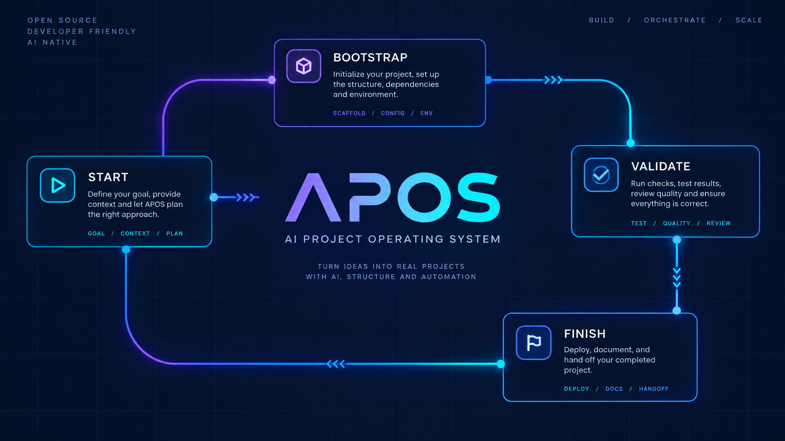

# APOS

[](https://skills.sh/ahmdd4vd/apos)

[](./docs/videos/apos-overview.mp4)

**APOS (AI Project Operating System)** adalah skill tata kelola proyek yang membantu coding agent menjaga kesinambungan proyek software. APOS menjaga konteks proyek, requirements, arsitektur, keputusan teknis, ownership task, changelog, dan pengetahuan jangka panjang tetap selaras lintas sesi.

> APOS adalah lapisan panduan dan sinkronisasi. APOS tidak menggantikan coding agent dan tidak melakukan tindakan irreversible tanpa otorisasi yang sesuai.

## Fitur utama

- Memeriksa state repository sebelum pekerjaan non-trivial dimulai.
- Mengklasifikasikan perubahan berdasarkan risiko: trivial, routine, significant, atau critical.
- Menjaga hubungan antara goals, requirements, tasks, architecture, decisions, changelog, dan memory.
- Menerapkan workflow proporsional: `READ → ANALYZE → PLAN → EXECUTE → VALIDATE → UPDATE STATE → REPORT`.
- Membantu mencegah drift arsitektur dan dokumentasi dari implementasi yang sudah tervalidasi.
- Mendukung audit kesehatan proyek dan pelaporan drift berdasarkan severity.
- Menyediakan format laporan akhir yang ringkas dan actionable.

## Instalasi melalui skills.sh

```bash
npx skills add https://github.com/ahmdd4vd/apos/tree/main/skill/apos
```

Perintah ini memasang skill untuk project saat ini. Untuk instalasi global:

```bash
npx skills add https://github.com/ahmdd4vd/apos/tree/main/skill/apos -g
```

Untuk agent tertentu, gunakan `--agent`, misalnya Claude Code:

```bash
npx skills add https://github.com/ahmdd4vd/apos/tree/main/skill/apos --agent claude-code
```

Untuk melihat skill tanpa memasang atau melakukan instalasi non-interaktif:

```bash
npx skills add https://github.com/ahmdd4vd/apos/tree/main/skill/apos --list
npx skills add https://github.com/ahmdd4vd/apos/tree/main/skill/apos -y
```

Lihat [dokumentasi skills.sh](https://www.skills.sh/docs) untuk referensi lengkap.

## Panduan penggunaan

### Kapan menggunakan APOS

Gunakan APOS untuk feature baru, bug fix lintas komponen, perubahan API/database/authentication, perubahan arsitektur, koordinasi beberapa agent atau worktree, audit drift, dan persiapan release atau migrasi besar. Untuk typo atau formatting sederhana, APOS menggunakan proses ringan.

### Memulai task

Minta agent menggunakan APOS secara eksplisit:

```text
Use APOS for this task. Inspect the repository state first, classify the change, identify relevant tasks and architecture decisions, implement the smallest safe change, validate it, update affected artifacts, and provide an APOS Report.
```

Untuk feature baru, minta agent membaca goals, requirements, architecture, dan decisions sebelum membuat task atau mengubah code.

### Workflow berdasarkan risiko

| Jenis | Contoh | Workflow |
| --- | --- | --- |
| **Trivial** | Typo, formatting, dokumentasi kecil | Read, execute, validate, report |
| **Routine** | Bug fix, test, feature kecil, refactor lokal | Read, analyze, plan, execute, validate, update state, report |
| **Significant** | API, database, authentication, shared component | Read, analyze, impact check, execute, validate, update state, report |
| **Critical** | Breaking change, migrasi destructive, security, permissions | Impact analysis lengkap, risiko dan rollback, authorization, execute, validate |

### State proyek dan dokumentasi

Jika `.apos/` sudah ada, baca file yang relevan sebelum bekerja. Jika belum ada, buat hanya direktori yang diperlukan:

```text
.apos/
├── goals/
├── prd/
├── architecture/
├── decisions/
├── tasks/
├── changelog/
└── memory/
```

Task biasanya berisi ID stabil, title, owner, status, priority, dependencies, referensi requirements atau decisions, serta acceptance criteria. Update hanya artifact yang terdampak secara material; jangan membuat struktur administratif kosong.

### Validasi, audit, dan laporan

Validasi harus proporsional: jalankan test, type checking, linting, build, migration check, security check, atau smoke test sesuai risiko. Untuk audit, periksa task stale atau tanpa owner, requirements yang hilang, decision yang konflik, architecture drift, changelog tidak lengkap, projection stale, dan issue tanpa follow-up.

Gunakan severity **Critical**, **High**, **Medium**, dan **Low**, bukan numeric score yang tidak transparan. Format laporan:

```markdown
## APOS Report

### Change
- Summary:
- Classification:
- Task:

### Validation
- Checks run:
- Result:

### State updates
- Updated artifacts:
- Intentionally unchanged artifacts:

### Risks and follow-up
- Known risks:
- Follow-up work:
```

## Prinsip desain

1. Lindungi intent proyek dan realitas implementasi.
2. Gunakan proses terkecil yang tetap aman.
3. Jadikan perubahan material dapat ditelusuri.
4. Pertahankan keputusan penting.
5. Jelaskan ownership dan batas tanggung jawab.
6. Perlakukan perubahan arsitektur sebagai perubahan berisiko.
7. Buat pengetahuan penting bertahan lintas sesi.
8. Hindari duplikasi source of truth.
9. Utamakan konsistensi tanpa birokrasi yang tidak perlu.
10. Tinggalkan proyek agar mudah dipahami developer baru.

## Integrasi instruksi agent

Instalasi skill APOS tidak otomatis mengubah project. Agar agent selalu mengingat APOS, adopsikan APOS ke file instruksi project seperti `AGENTS.md` dan/atau `CLAUDE.md`.

Simpan workflow lengkap di [`skill/apos/SKILL.md`](./skill/apos/SKILL.md), lalu tambahkan pengingat wajib yang ringkas:

```markdown
## APOS Governance

This project uses APOS for project governance and continuity.

For every non-trivial task:
1. Inspect the repository and relevant `.apos/` state.
2. Classify the change and create or update a task when required.
3. Run proportional validation.
4. Run the APOS Finish Protocol before reporting completion.
5. Synchronize affected tasks, decisions, architecture, changelog, or memory.
6. Provide an APOS Report.

Full workflow: `skill/apos/SKILL.md`
Project state: `.apos/`
```

Jangan menyalin seluruh skill ke `AGENTS.md` atau `CLAUDE.md`. Pertahankan instruksi yang sudah ada dan tambahkan bagian APOS secara terpisah. Instalasi skill dan adopsi APOS adalah dua hal berbeda: instal skill melalui `npx skills add`, lalu integrasikan APOS ke project dengan file instruksi agent dan state `.apos/` minimum.

## Video overview

Watch the [APOS overview video](./docs/videos/apos-overview.mp4) to see the repository detection, Bootstrap Protocol, Start Protocol, Finish Protocol, and agent integration flow.


## File

- [`skill/apos/SKILL.md`](./skill/apos/SKILL.md) — instruksi utama untuk coding agent.
- [`README.md`](./README.md) — dokumentasi bahasa Inggris.

## Status dan lisensi

APOS berada pada tahap **Beta / governance skill**. Implementasi API, console, CLI, MCP adapter, dan database direncanakan terpisah. Lisensi repository belum ditentukan.
